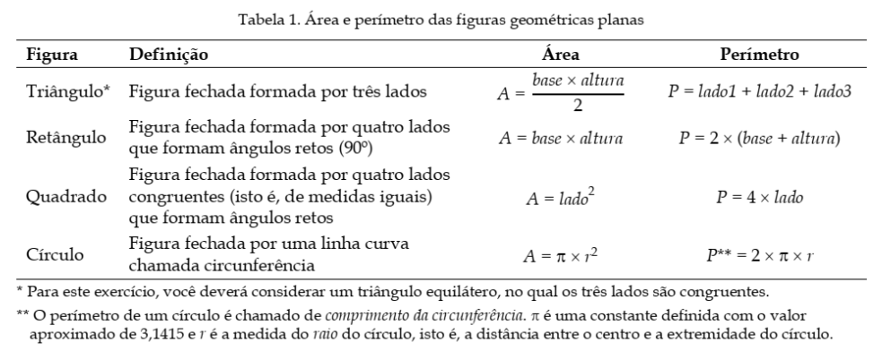
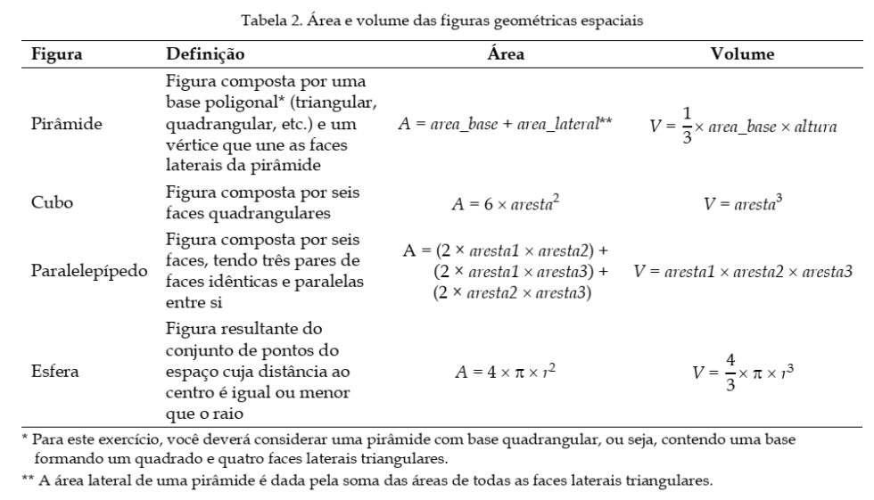
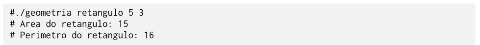

# Laboratório 1

A Geometria é fundamental para resolver problemas em agricultura, astronomia, arquitetura e engenharia. Dentre as divisões da Geometria, encontram-se as chamadas Geometria Plana e Geometria Espacial. A Geometria Plana refere-se ao estudo das figuras geométricas definidas em um plano de duas dimensões, enquanto que a Geometria Espacial se encarrega do estudo das figuras geométricas (também chamadas de sólidos geométricos) definidas no espaço, ou seja, aquelas que possuem mais de duas dimensões e ocupam um lugar no espaço. As principais figuras geométricas planas são o triângulo, o quadrado, o retângulo e o círculo. Já as principais figuras geométricas espaciais são o cubo, a esfera, o cone, a pirâmide, o paralelepípedo e o cilindro.

Três conceitos são de suma importância para o entendimento das Geometrias Plana e Espacial, a saber, a área, o perímetro e o volume. A área de uma figura geométrica, seja ela plana ou espacial, expressa o tamanho de tal figura sobre uma superfície, de modo que quanto maior a superfície da figura, maior a sua área. O perímetro de uma figura geométrica é definido como a medida do contorno que delimita a figura, sendo resultante da soma das medidas de todos os seus lados. Por fim, o volume corresponde à medida do espaço ocupado por uma figura geométrica. Para encontrar os valores dessas medidas, é importante analisar o tipo da figura (se plana ou espacial) e a forma da figura, isto é, quantos e quais são os lados.

**Área, perímetro e volume de figuras geométricas planas e espaciais**

As Tabelas 1 e 2 apresentam a definição das principais figuras geométricas planas e espaciais, bem como as fórmulas utilizadas para calcular as medidas de área, perímetro e volume. É importante notar que, pelo fato de as figuras geométricas planas serem definidas em um plano de duas dimensões, elas não possuem volume.

+ para a pirâmide, considere que a entrada do programa é o valor de um dos lados da base e a altura de um dos triangulos da face lateral.

# Tarefa

Implemente um programa em C++ que permita calcular as medidas de diversas figuras geométricas planas e espaciais. O programa deverá receber, por meio da linha de comando, a indicação da forma geométrica e os dados necessários para os cálculos. Como resultado, o programa deve exibir as respectivas medidas (área, perímetro ou volume) da figura escolhida. **Note que, para figuras geométricas planas, o programa deve exibir apenas a área e o perímetro; para figuras geométricas espaciais, o programa deve exibir apenas a área e o volume da figura.** Para calcular tais medidas, você deve fazer uso das equações matemáticas apresentadas nas Tabelas 1 e 2, além dos seus próprios conhecimentos matemáticos na área de Geometria.

Na implementação das funções que calculam as medidas de área, perímetro e volume das figuras, você pode fazer uso da biblioteca `<cmath>`. Dentre as funções disponibilizadas por essa biblioteca, existem: (i) a função `pow`, que realiza a operação de potenciação de uma base e um expoente, recebidos como parâmetro, e (ii) a função `sqrt`, que calcula a raiz quadrada de um número recebido como parâmetro.

**Exemplos de entrada e saída**

Conforme mencionado anteriormente, o programa em execução deve receber por linha de comando a indicação da forma geométrica, seguida dos dados necessários para os cálculos. No exemplo a seguir, é passado na linha de comando a indicação da forma “retângulo”, seguido dos dados “base” e “altura”. Com isso, o programa irá instanciar a forma apropriada e imprimir o resultado dos cálculos.

## Orientações gerais
+ Inclua seus arquivos nas pastas `src` e `include`. Não modifique a pasta `.github`.
+ Você deverá escrever um arquivo Makefile para gerenciar o processo de compilação.
+ O arquivo executável deve ser direcionado para a pasta `bin` (não é preciso adicionar o executável ao repositório, apenas indicar o seu caminho no Makefile)
+ Considere pi=3.1416

**Este exercício é uma versão do original elaborado pelo Prof. Silvio Sampaio (IMD/UFRN)** 

